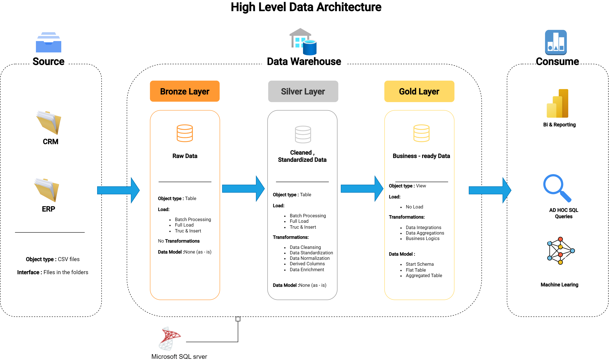
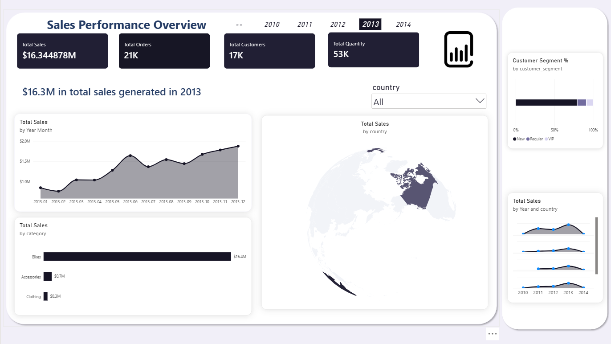

# Data Warehouse and Analytics Project

A hands-on **SQL Server data warehouse and analytics project** that covers the complete journey from raw source data to business-ready insights.

The project focuses on building a modern data warehouse, moving data through **Bronze, Silver, and Gold layers**, and using SQL for reporting and analysis.

---

## 🏗️ Data Architecture

The project follows a **Medallion Architecture** with three main layers: **Bronze, Silver, and Gold**.



### 🥉 Bronze Layer — Raw Data

The Bronze layer is where the source data first enters the warehouse.

- Data is imported from **ERP and CRM source systems** as CSV files.
- The data is loaded into a **SQL Server database**.
- Data is stored in its original form with no major transformations.
- This layer provides the raw foundation for the rest of the warehouse.

### 🥈 Silver Layer — Cleaned and Standardized Data

The Silver layer prepares the raw data for reliable analysis.

The main processes include:

- Data cleansing
- Data standardization
- Data normalization
- Derived columns
- Data enrichment

### 🥇 Gold Layer — Business-Ready Data

The Gold layer contains data that is ready to be used for reporting and analytics.

This layer includes:

- Data integrations
- Data aggregations
- Business logic
- Business-ready views and tables
- Star schema modeling
- Flat tables
- Aggregated tables

---

## 📖 Project Overview

This project brings together the key stages involved in building a modern data warehouse and turning the resulting data into useful insights.

### 1. Data Architecture

Designing a modern data warehouse using the **Bronze, Silver, and Gold Medallion Architecture**.

### 2. ETL Pipelines

Extracting, transforming, and loading data from source systems into the warehouse.

### 3. Data Modeling

Developing fact and dimension tables optimized for analytical queries.

### 4. Analytics and Reporting

Creating SQL-based reports and dashboards to turn warehouse data into actionable insights.

Through the project, the following areas are covered:

- SQL Development
- Data Architecture
- Data Engineering
- ETL Pipeline Development
- Data Modeling
- Data Analytics

---

## 🛠️ Important Tools

The project uses the following tools and resources:

- **Datasets:** The CSV files used as the project's source data.
- **SQL Server Express:** A lightweight SQL Server edition used for hosting the SQL database.
- **SQL Server Management Studio (SSMS):** A GUI for managing and interacting with SQL Server databases.
- **Git Repository:** Used to manage, version, and collaborate on project code.
- **Draw.io:** Used to design data architecture, data models, data flows, and other diagrams.
- **Notion:** Provides the project template and supporting resources.
- **Notion Project Steps:** Provides the project phases and tasks.

## 🚀 Project Requirements

### Building the Data Warehouse (Data Engineering)

#### Objective

Develop a modern data warehouse using **SQL Server** to consolidate sales data, enabling analytical reporting and informed decision-making.

#### Specifications

- **Data Sources:** Import data from two source systems, **ERP and CRM**, provided as CSV files.
- **Data Quality:** Cleanse and resolve data quality issues before analysis.
- **Integration:** Combine both sources into a single, user-friendly data model designed for analytical queries.
- **Scope:** Focus on the latest dataset only; historization of data is not required.
- **Documentation:** Provide clear documentation of the data model to support both business stakeholders and analytics teams.

---

## 📊 BI: Analytics and Reporting (Data Analysis)

### Objective

Develop SQL-based analytics to provide detailed insights into:

- **Customer Behavior**
- **Product Performance**
- **Sales Trends**

These insights provide stakeholders with key business metrics that can support strategic decision-making.

## 📈 Power BI Sales Performance Dashboard

The business problem behind this project is simple: sales data comes from
different CRM and ERP sources, so it is difficult to get one reliable view of
customers, products, and sales performance. This dashboard turns the cleaned
and integrated warehouse data into a report that a sales or management team
can use to understand what is happening and where attention may be needed.

The report focuses on questions such as:

- How are sales, orders, and quantity changing over time?
- Which products and categories generate the most revenue?
- Which customers contribute the most sales?
- How do customer segments and age groups behave?
- Which countries represent the strongest markets?

The dashboard includes an executive overview, sales trend analysis, product
performance, customer analysis, and geographic analysis. It uses KPI cards,
time-series charts, category and product comparisons, customer segments, and
country-level visuals to make the results easy to explore.

The report is powered by the Gold layer of the warehouse:

- `gold.fact_sales` provides the transaction-level sales measures.
- `gold.dim_customers` provides customer and demographic attributes.
- `gold.dim_products` provides product, category, and product-line attributes.
- `gold.report_customers` provides customer-level aggregated metrics and segments.
- `gold.report_products` provides product-level aggregated metrics and performance segments.

### Dashboard Preview



The Power BI file is available here:

[Open the Power BI report](docs/powerbi/sales_perfomance_overview.pbix)

Power BI Desktop is required to open the `.pbix` file. The SQL scripts,
testing queries, and dashboard instructions are included in this repository so
the data model and reported metrics can be understood and reproduced.

---

## 📂 Repository Structure

```text
data-warehouse-project/
│
├── datasets/                           # Raw datasets used for the project (ERP and CRM data)
│
├── docs/                               # Project documentation and architecture details
│   ├── etl.drawio                      # Draw.io file showing ETL techniques and methods
│   ├── data_architecture.drawio        # Draw.io file showing the project's architecture
│   ├── data_catalog.md                 # Catalog of datasets, including field descriptions and metadata
│   ├── data_flow.drawio                # Draw.io file for the data flow diagram
│   ├── data_models.drawio              # Draw.io file for data models (star schema)
│   └── naming-conventions.md            # Consistent naming guidelines for tables, columns, and files
│
├── scripts/                            # SQL scripts for ETL and transformations
│   ├── bronze/                         # Scripts for extracting and loading raw data
│   ├── silver/                         # Scripts for cleaning and transforming data
│   └── gold/                           # Scripts for creating analytical models
│
├── tests/                              # Test scripts and quality files
│
├── README.md                           # Project overview and instructions
├── LICENSE                             # License information for the project
├── .gitignore                          # Files and directories to be ignored by Git
└── requirements.txt                    # Dependencies and requirements for the project
```

---

## 🛡️ License

This project is licensed under the [MIT License](LICENSE). You are free to use, modify, and share this project with proper attribution.

---

## 🌟 About the Project

This repository brings together practical work in **data warehousing, ETL, data modeling, SQL development, and analytics**.

The project is intended to provide a clear, hands-on example of how raw source data can be transformed into a structured warehouse and then used for reporting and analysis.

Thanks for checking out the project!
